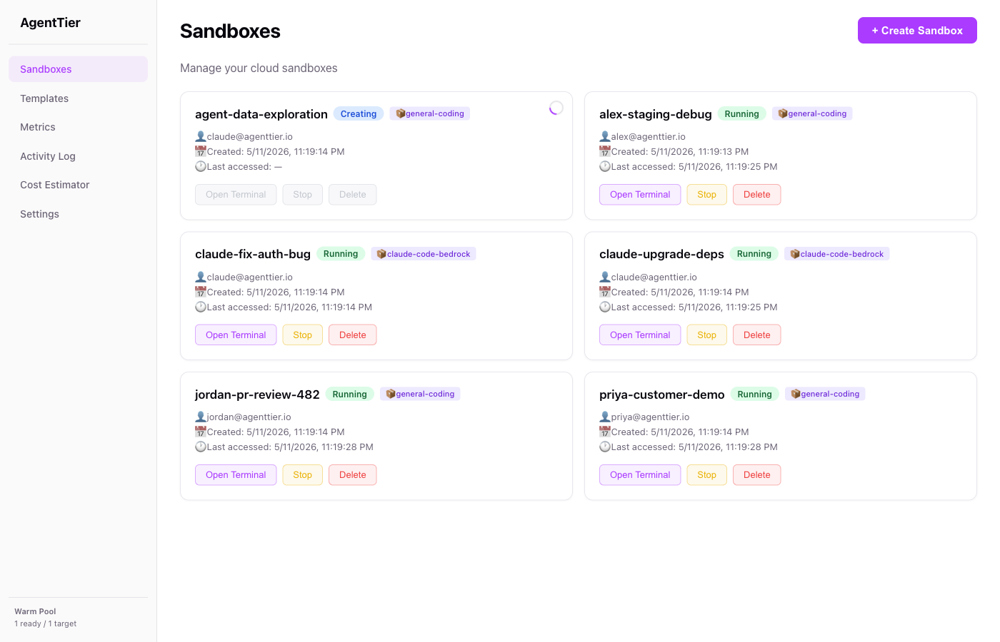
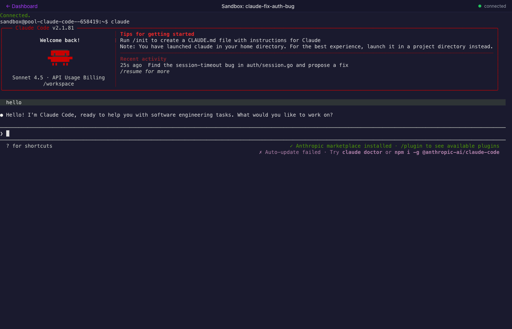

<p align="center">
  <h1 align="center">AgentTier</h1>
  <p align="center">
    <strong>Enterprise-grade Kubernetes-native sandboxes — for humans and AI agents.</strong>
  </p>
  <p align="center">
    <a href="https://github.com/agenttier/agenttier/actions"></a>
    <a href="https://github.com/agenttier/agenttier/releases"></a>
    <a href="https://pypi.org/project/agenttier/"></a>
    <a href="https://goreportcard.com/report/github.com/agenttier/agenttier"></a>
    <a href="LICENSE"></a>
  </p>
  <p align="center">
    <a href="https://agenttier.github.io/agenttier/"><strong>Documentation</strong></a> ·
    <a href="https://agenttier.github.io/agenttier/quickstart/">Quickstart</a> ·
    <a href="https://agenttier.github.io/agenttier/tutorials/">Tutorials</a> ·
    <a href="https://agenttier.github.io/agenttier/sdk/">SDK</a> ·
    <a href="https://github.com/agenttier/agenttier/releases/latest">Releases</a>
  </p>
</p>

---

## What is AgentTier?

AgentTier is a Kubernetes-native platform that provides isolated, persistent sandbox environments for running AI agents and human developers. Each sandbox is a pod with its own persistent storage, network isolation, and interactive terminal access — managed declaratively through Custom Resource Definitions.

**Key use cases:**
- Run AI coding agents (Claude Code, Cursor, Aider) in secure, isolated environments
- Provide on-demand development environments for engineering teams
- Execute untrusted AI-generated code with kernel-level isolation (gVisor)
- Orchestrate multi-agent workflows with inter-sandbox communication

---

## Screenshots

<p align="center">
  
  <em>Dashboard with a mix of human developer sandboxes and Claude Code agent sandboxes.</em>
</p>

<p align="center">
  
  <em>Full PTY in the browser. This sandbox is running Claude Code against AWS Bedrock.</em>
</p>

---

## Deploy from source

All paths build images from source. No published artifacts are required.

### Configuration (optional)

Copy the example config and edit before running `deploy.sh`. All variables have defaults — skip this step to use the defaults.

```bash
cp config/config.env.example config/config.env
# Edit config/config.env to override registry, tag, region, etc.
```

Key variables (see `config/config.env.example` for the full list):

| Variable | Default | Purpose |
|---|---|---|
| `AGENTTIER_REGISTRY` | `ghcr.io/agenttier` | Registry prefix for built images |
| `AGENTTIER_IMAGE_TAG` | _(derived)_ | Derived from `VERSION` file (clean tree) or `sha-<hash>[-dirty]` |
| `AGENTTIER_AWS_REGION` | `us-east-1` | AWS region for Terraform + ECR |
| `AGENTTIER_EKS_PLATFORM` | `linux/amd64` | Target build platform for EKS nodes |
| `AGENTTIER_NAMESPACE` | `agenttier` | Kubernetes namespace for the Helm release |
| `AGENTTIER_CLUSTER_TOOL` | _(autodetect)_ | Force `kind` or `minikube` for `--target=local` (also settable via `--cluster-tool=<kind\|minikube>`); unset autodetects, preferring kind when both are installed |

### Path 1: Local cluster (kind or minikube)

**Prerequisites:** `docker`, `kubectl`, `helm`, `go` 1.25+, and `kind` or `minikube`. The deploy script requires **bash 3.2+** (standard on macOS).

```bash
git clone https://github.com/agenttier/agenttier.git
cd agenttier
./deploy.sh --target=local
# Or force a specific tool when both kind and minikube are installed:
./deploy.sh --target=local --cluster-tool=minikube
```

What this does:

1. Creates a `kind` (or `minikube`) cluster named `agenttier-local` if one does not exist. Autodetects between the two (preferring kind) unless `--cluster-tool=<kind|minikube>` (or `AGENTTIER_CLUSTER_TOOL`) forces the choice.
2. Builds all nine container images from source for your local architecture: 3 core images (controller, router, web-ui) and 6 sandbox images (sandbox-general, sandbox-claude-code, sandbox-openclaw, sandbox-langgraph, sandbox-rl, sandbox-strands-bedrock).
3. Side-loads images into the cluster — no registry or push required.
4. Installs the Helm chart from the local `helm/agenttier/` tree with `auth.devAuth=true` (local development only; never set in production).
5. Runs `scripts/smoke-test.sh` — creates a test sandbox, waits for `Phase=Running`, runs an exec, then cleans up.

**Expected output** (abbreviated):

```
==> Checking local prerequisites
[agenttier] Local prerequisites OK.
==> Ensuring local cluster exists
[agenttier] Creating kind cluster 'agenttier-local'...
==> Building container images (local arch)
[agenttier] Building controller image: ghcr.io/agenttier/controller:sha-<hash>
[agenttier] Building sandbox-general image: ghcr.io/agenttier/sandbox-general:sha-<hash>
==> Loading images into local cluster
==> Installing / upgrading Helm chart
[agenttier] Helm release: agenttier → namespace: agenttier
==> Running smoke test
[smoke 12:34:56] PASS: Controller deployment Available.
[smoke 12:34:57] PASS: Found 6 ClusterSandboxTemplate(s).
[smoke 12:35:10] PASS: Sandbox 'smoke-test-12345' is Running.
[smoke 12:35:11] PASS: exec round-trip via Router API succeeded.
[smoke 12:35:11] PASS: PTY WebSocket upgrade handshake succeeded (101 Switching Protocols).
[smoke 12:35:11] PASS: ALL SMOKE TESTS PASSED.

[agenttier] Local deploy complete!
[agenttier] Access the web UI:   kubectl port-forward -n agenttier svc/agenttier-webui 8080:80
[agenttier] Access the router:   kubectl port-forward -n agenttier svc/agenttier-router 8081:8080
[agenttier] Tear down:           ./deploy.sh --target=local --teardown
```

**Teardown:**

```bash
./deploy.sh --target=local --teardown
```

Uninstalls the Helm release and deletes the kind/minikube cluster. If both tools are installed, pass the same `--cluster-tool=<kind|minikube>` (or `AGENTTIER_CLUSTER_TOOL`) used at deploy time so teardown targets the right cluster.

---

### Path 2: AWS EKS

**Prerequisites:** `aws` CLI (configured with credentials), `terraform` >= 1.10 (the S3 state backend's native lockfile requires it — see [state backend](#terraform-state-backend) below), `kubectl`, `helm`, `jq`, `zip`. **Docker with `buildx` is required only for the default local-build path** — if you have no local Docker daemon, use the [CodeBuild path](#codebuild-in-cloud-image-builds-eks-only) (images are built in AWS), which `deploy.sh` selects automatically when `docker buildx` is unavailable.

**Cost note:** an EKS cluster with the default Terraform configuration costs approximately $8-10/day. Run `./deploy.sh --target=eks --teardown` when done to avoid ongoing charges.

**EKS API endpoint exposure.** The Terraform module's `endpoint_access_mode` variable controls how the cluster's Kubernetes API server is reachable:

- **`public-restricted` (default):** the public endpoint stays on, but you must supply a narrow CIDR allowlist — `cluster_endpoint_public_access_cidrs` defaults to `[]` and **rejects `0.0.0.0/0`** (a breaking change from earlier versions of this module, which defaulted to the whole internet). Laptop-friendly: `terraform apply`, `kubectl`, and `helm` all work directly from wherever you run `deploy.sh`.
- **`private`:** the public endpoint is off entirely. `terraform apply` still runs fine from a laptop (it's pure AWS-API calls — creating a private-endpoint cluster doesn't require reaching its API), but the on-cluster steps (installing the AWS Load Balancer Controller + the AgentTier Helm chart, running the smoke test) have no public path to the API server, so `deploy.sh` delegates them to a **CodeBuild project running inside the VPC** instead of running `kubectl`/`helm` locally. Requires `enable_codebuild = true` (enforced by a Terraform precondition). Human operators reach the private API via an **SSM Session Manager port-forward** — see [Accessing a private-mode cluster](#accessing-a-private-mode-cluster-ssm-port-forward) below.

```bash
terraform apply -var="endpoint_access_mode=private" -var="enable_codebuild=true"   # private mode
```

#### Terraform state backend

Earlier versions of this module shipped with **no backend block** (state stayed local, so the module was drop-in). That changed: `terraform/aws-eks/backend.tf` now configures an **S3 backend with the native S3 lockfile** (`use_lockfile = true`, no DynamoDB table) — required because private-mode's CodeBuild-in-VPC deploy actor and a human's laptop both need to read/write the *same* state, which local state can't do. Bootstrap the bucket once (versioned, SSE-KMS encrypted, Block Public Access, TLS-only policy, `data-classification=confidential` tagged):

```bash
./scripts/bootstrap-tfstate.sh                      # defaults to agenttier-tfstate-<account-id>
cp terraform/aws-eks/backend.hcl.example terraform/aws-eks/backend.hcl
# edit backend.hcl with the bucket name AND kms_key_id printed above, then:
cd terraform/aws-eks && terraform init -backend-config=backend.hcl
```

`kms_key_id` is required for `terraform.tfstate` itself to land under SSE-KMS
— Terraform's S3 backend otherwise encrypts every state write with its own
explicit AES256 (SSE-S3), independent of the bucket's default encryption.

For a quick local-only eval with no shared state, `terraform init -backend=false` still works and the module falls back to local state — you never have to run the bootstrap script just to try it out.

```bash
git clone https://github.com/agenttier/agenttier.git
cd agenttier

# Optional: override AWS region (default: us-east-1) and other settings
cp config/config.env.example config/config.env
# Edit AGENTTIER_AWS_REGION in config/config.env

./deploy.sh --target=eks
```

What this does:

1. Verifies AWS credentials via `aws sts get-caller-identity`.
2. Runs `terraform apply` in `terraform/aws-eks/` — provisions VPC, EKS cluster, managed node groups (including an optional gVisor group), EBS CSI, IRSA roles (including for the AWS Load Balancer Controller — the controller itself is installed by `deploy.sh`, not Terraform), ECR repositories, a Cognito User Pool for OIDC auth, scoped EKS Access Entries (replacing blanket creator-admin), control-plane logging (api/audit/authenticator to a managed CloudWatch log group), and optionally GuardDuty EKS Protection.
3. Reads ECR registry URLs, cluster/VPC info, and Cognito OIDC settings from Terraform outputs. Any empty mandatory output fails immediately with a clear message.
4. Builds and pushes all nine images to ECR — 3 core images (controller, router, web-ui) and 6 sandbox images (sandbox-general, sandbox-claude-code, sandbox-openclaw, sandbox-langgraph, sandbox-rl, sandbox-strands-bedrock) — via one of two paths:
   - **Local buildx (default):** authenticates Docker to ECR and builds+pushes with `docker buildx` at `$AGENTTIER_EKS_PLATFORM` (default `linux/amd64`).
   - **AWS CodeBuild (no local Docker, or always in `private` endpoint mode):** zips the source, uploads it to the CodeBuild S3 bucket, and runs the in-cloud build — see [CodeBuild path](#codebuild-in-cloud-image-builds-eks-only). The core images are hard-required; the four extra agent-sandbox images (openclaw, langgraph, rl, strands-bedrock) build best-effort so one upstream failure does not block the deploy.
5. Installs the AWS Load Balancer Controller and the AgentTier Helm chart, then runs `scripts/smoke-test.sh`:
   - **`public-restricted` (default):** runs locally — `aws eks update-kubeconfig`, `helm upgrade --install` for both releases, then the smoke test, exactly as `kubectl`/`helm` would from your machine.
   - **`private`:** delegates the same three steps to a second CodeBuild run inside the VPC (`ci/buildspec-deploy.yml`), passing cluster/ECR/Cognito values as environment overrides and polling to completion with the same bounded-timeout loop used for image builds.
   The AgentTier chart's `crds/` directory installs the CRDs first (so the bundled default `ClusterSandboxTemplate`s apply cleanly on a fresh install), then wires Cognito OIDC auth and deploys a default gp3 EBS StorageClass so sandbox PVCs bind immediately. Dev-auth is never set on the EKS path.

**Expected output** (abbreviated):

```
==> Checking EKS prerequisites
[agenttier] EKS prerequisites OK.
==> Provisioning infrastructure via Terraform
...
==> Reading Terraform outputs
[agenttier] ECR registry     : 123456789012.dkr.ecr.us-east-1.amazonaws.com/agenttier
[agenttier] EKS cluster      : agenttier-eks
==> Building images with docker buildx (platform: linux/amd64)
...
==> Installing / upgrading Helm chart
==> Running smoke test
[smoke 12:34:56] PASS: ALL SMOKE TESTS PASSED.

[agenttier] EKS deploy complete!
[agenttier] Cluster         : agenttier-eks
[agenttier] Region          : us-east-1
[agenttier] Cognito issuer  : https://cognito-idp.us-east-1.amazonaws.com/...
[agenttier] Estimated cost: ~$8-10/day while cluster is running.
```

**Teardown** (removes all billable AWS resources):

```bash
./deploy.sh --target=eks --teardown
```

This uninstalls the Helm release, deletes sandbox PVCs and LoadBalancer services (waiting for AWS LB deprovisioning), then runs `terraform destroy -auto-approve`. No orphaned resources are left behind.

---

### Accessing a private-mode cluster (SSM port-forward)

In `endpoint_access_mode = private`, there is no public path to the Kubernetes API — CI/deploy reaches it via CodeBuild-in-VPC (above), and **human operators reach it via an SSM Session Manager port-forward** through one of the managed node group instances (no bastion, no inbound security-group rule, no SSH key; IAM-gated and outbound-initiated only). The node instance role already carries `AmazonSSMManagedInstanceCore` for this purpose.

> **Operator prerequisite:** `aws ssm start-session` needs the [`session-manager-plugin`](https://docs.aws.amazon.com/systems-manager/latest/userguide/session-manager-working-with-install-plugin.html) installed on your workstation (the AWS CLI does not bundle it; without it you get `SessionManagerPlugin is not found`). Install once — macOS: `brew install --cask session-manager-plugin`; Linux: see the AWS docs. Not required to deploy — only for this operator port-forward. Full runbook (with the `tls-server-name` kubeconfig step): [docs/port-forwarding.md](docs/docs/port-forwarding.md).

```bash
# 1. Find a running managed-node instance in the cluster (cluster_name comes
#    from the terraform output, not hardcoded — a non-default cluster_name
#    would otherwise match zero instances).
cd terraform/aws-eks
CLUSTER_NAME=$(terraform output -raw cluster_name)
INSTANCE=$(aws ec2 describe-instances \
  --filters "Name=tag:eks:cluster-name,Values=${CLUSTER_NAME}" "Name=instance-state-name,Values=running" \
  --query 'Reservations[0].Instances[0].InstanceId' --output text)

# 2. Resolve the private API endpoint host (terraform output, scheme stripped).
APISERVER=$(terraform output -raw cluster_endpoint_private_host)
cd -

# 3. Tunnel local :6443 -> apiserver:443 through the node via SSM.
aws ssm start-session --target "$INSTANCE" \
  --document-name AWS-StartPortForwardingSessionToRemoteHost \
  --parameters "{\"host\":[\"$APISERVER\"],\"portNumber\":[\"443\"],\"localPortNumber\":[\"6443\"]}"

# 4. In a second terminal, point kubectl at the tunnel. The API server's cert is
#    issued for $APISERVER, not "localhost" — set tls-server-name so TLS
#    validation still succeeds through the tunnel (avoids insecure-skip-tls-verify).
kubectl config set-cluster agenttier-private --server="https://localhost:6443"
kubectl config set-cluster agenttier-private --tls-server-name="$APISERVER"
kubectl --context <your-context-using-agenttier-private> get nodes
```

The same tunnel technique reaches the web UI: once the API tunnel is up, `kubectl port-forward -n agenttier svc/agenttier-webui 8080:80` works exactly as it does in `public-restricted` mode. See `docs/docs/port-forwarding.md` and `docs/docs/security.md` for the full runbook and TLS/SNI details.

---

### CodeBuild (in-cloud image builds, EKS only)

If you have **no local Docker daemon** (or want to offload builds in an air-gapped / slow-network
environment), `deploy.sh --target=eks` can build and push all images in **AWS CodeBuild** instead of
local `docker buildx`.

**How the path is selected.** `deploy.sh` sets `USE_CODEBUILD=true` when **either**:

- you export `AGENTTIER_USE_CODEBUILD=true`, **or**
- `docker buildx` is not available on the machine (auto-detected).

When selected, `deploy.sh`:

1. Passes `-var=enable_codebuild=true` to `terraform apply`, which provisions the CodeBuild project
   and an encrypted S3 source bucket (both destroyed on teardown).
2. Skips the local Docker prerequisite checks and the local `docker login` to ECR (the in-cloud
   build authenticates itself).
3. Zips the working tree (excluding `.git`, `terraform/`, and any `node_modules`/`.venv`/`dist`/`bin`),
   uploads it to the S3 bucket, starts the build, and polls to completion (bounded by
   `codebuild_timeout_minutes`).
4. Passes `IMAGE_TAG`, `ECR_REPO_PREFIX`, and `BUILD_PLATFORM` as build-time environment overrides so
   CodeBuild pushes the **same tag** the Helm install references (no `ImagePullBackOff`).

```bash
# No local Docker? Just run the normal command — CodeBuild is auto-selected.
./deploy.sh --target=eks

# Or force it explicitly:
AGENTTIER_USE_CODEBUILD=true ./deploy.sh --target=eks
```

The build classifies images as **core** (controller, router, web-ui, sandbox-general,
sandbox-claude-code — a failure aborts the deploy) and **optional** agent sandboxes (openclaw,
strands-bedrock, langgraph, rl — built best-effort; a single upstream failure is reported but does
not block the deploy). A failed optional image surfaces later as `ImagePullBackOff` only if you
create a sandbox from that specific template.

**Deploy-build path (`endpoint_access_mode = private` only).** This CodeBuild project also runs a
*second*, separate build for the on-cluster deploy steps when the API endpoint is private (see
[Path 2: AWS EKS](#path-2-aws-eks) step 5) — same project and source zip, different buildspec
(`ci/buildspec-deploy.yml` instead of `ci/buildspec.yml`). `deploy.sh` starts it with the cluster/ECR/
Cognito values as `--environment-variables-override` after the image build succeeds, and polls it
to completion the same way. It installs the AWS Load Balancer Controller + the AgentTier Helm chart
and runs `scripts/smoke-test.sh` from inside the VPC, since a private endpoint has no other path to
reach the cluster during a build. In `public-restricted` mode this second build never runs — those
steps execute locally instead.

---

### Forking / custom registry

To deploy from a fork using your own registry, set the following in `config/config.env`:

```bash
AGENTTIER_REGISTRY=your-registry.example.com/your-prefix
AGENTTIER_AWS_REGION=us-west-2        # if using EKS
```

No source edits are required. The EKS path reads the actual ECR registry URL from `terraform output ecr_registry` and overrides `AGENTTIER_REGISTRY` automatically.

---

## Usage

After a successful deploy, interact with AgentTier via the Python SDK, the CLI, or the REST API.

### Port-forward (local path)

```bash
# Web UI at http://localhost:8080
kubectl port-forward -n agenttier svc/agenttier-webui 8080:80 &

# Router API at http://localhost:8081
kubectl port-forward -n agenttier svc/agenttier-router 8081:8080 &
```

### Python SDK

Install from PyPI or from the source tree:

```bash
pip install agenttier           # from PyPI
# OR
pip install -e python-sdk/      # from source (no PyPI dependency)
```

```python
from agenttier import AgentTierClient

client = AgentTierClient(api_url="http://localhost:8081")  # or your EKS ALB URL

# Create a sandbox and wait for it to be Running
sandbox = client.create_sandbox(template="general-coding", name="my-sandbox")
sandbox.wait_until_running()

# Run a command
result = sandbox.exec("echo 'Hello from AgentTier!'")
print(result.stdout)  # Hello from AgentTier!

# Upload and download files
sandbox.files.write("/workspace/hello.py", "print('works!')")
content = sandbox.files.read("/workspace/hello.py")

# Open a browser terminal via port-forward + the web UI
# (use `kubectl port-forward -n agenttier svc/agenttier-webui 8080:80`)

# Stop and resume (all files are preserved)
sandbox.stop()
sandbox.resume()

# Clone (byte-identical workspace fork via CSI VolumeSnapshot)
clone = sandbox.clone(name="my-sandbox-clone")

# Delete
sandbox.terminate()
```

### CLI

Install from PyPI or build from source:

```bash
pip install agenttier           # from PyPI
# OR
make build && export PATH="$PATH:$(pwd)/bin"   # from source
```

Two CLIs share the `agenttier` binary name:

- **Python CLI** (`pip install agenttier`) — full sandbox lifecycle: `sandbox create/list/stop/resume/delete/exec/clone`, `template list/get`, `login`, `whoami`.
- **Go CLI** (`make build`) — agent-mode only: `configure`, `invoke`, `version`.

```bash
# Python CLI — sandbox lifecycle
export AGENTTIER_API_URL=http://localhost:8081

# List and create sandboxes (positional name, required --template)
agenttier sandbox list
agenttier sandbox create my-sandbox --template general-coding

# Exec, stop, resume, delete
agenttier sandbox exec my-sandbox -- echo "Hello"
agenttier sandbox stop my-sandbox
agenttier sandbox resume my-sandbox
agenttier sandbox delete my-sandbox

# Templates
agenttier template list
```

### Agent mode

```bash
# Go CLI (make build) — agent mode, top-level subcommands
export AGENTTIER_API_URL=http://localhost:8081

# Configure a sandbox with your agent code (--file remote-path=local-path)
agenttier configure my-sandbox \
  --file /workspace/my_agent.py=./my_agent.py \
  --install "pip install -r requirements.txt"

# Invoke (streams output as Server-Sent Events; closing the connection cancels the run)
agenttier invoke my-sandbox --prompt "Summarize the README"
```

---

## Sandbox lifecycle

```
Create -> Running -> Stop (pod deleted, PVC preserved) -> Resume (new pod, same PVC) -> Delete (all removed)
```

- **Stop** - preserves all files, packages, and git state. No compute cost while stopped.
- **Resume** - restores the exact filesystem state in ~5-10 seconds (warm pool: ~800 ms).
- **Delete** - permanently removes the sandbox and all data.
- **Clone** - takes a CSI VolumeSnapshot of the source PVC and provisions a new sandbox with a byte-identical workspace.

---

## Templates

Templates define reusable sandbox configurations. Built-in templates installed by the chart:

| Template | Description |
|---|---|
| `general-coding` | General-purpose coding sandbox |
| `claude-code-bedrock` | Claude Code CLI on AWS Bedrock (IRSA) |
| `openclaw-bedrock` | OpenClaw CLI on AWS Bedrock (IRSA) |
| `strands-bedrock` | Strands Agents Python SDK on AWS Bedrock (IRSA) |
| `langgraph-agent` | LangGraph agent-mode reference |
| `rl-rollout` | RL rollout worker (PyTorch, Ray RLlib, Gymnasium, Stable-Baselines3) |

Example template manifest:

```yaml
apiVersion: agenttier.io/v1alpha1
kind: ClusterSandboxTemplate
metadata:
  name: claude-code-bedrock
spec:
  description: "AI coding environment with Claude Code CLI on Bedrock"
  image:
    repository: ghcr.io/agenttier/sandbox-claude-code
  resources:
    requests: { cpu: "1", memory: 2Gi }
    limits: { cpu: "4", memory: 8Gi }
  storage:
    size: 20Gi
  network:
    allowInternet: true
  harness:
    shell: /bin/bash
    tools:
      - name: claude
        verifyCommand: "claude --version"
    hooks:
      onStart: "echo 'Sandbox ready'"
  timeout: 24h
  idleTimeout: 2h
```

---

## Architecture

```
+------------------------------------------------------------------+
|                      Kubernetes Cluster                          |
|                                                                  |
|  +------------+  +------------+  +----------+  +-----------+   |
|  | Controller |  |   Router   |  |  Web UI  |  |    etcd   |   |
|  | (operator) |  | (API + WS) |  | (nginx)  |  | (built-in)|   |
|  +-----+------+  +-----+------+  +----------+  +-----------+   |
|        |                |                                        |
|  +-----+----------------+--------------------------------------+ |
|  |                  Sandbox Namespace(s)                        | |
|  |  +----------+  +----------+  +----------+                  | |
|  |  |Sandbox 1 |  |Sandbox 2 |  |Sandbox N |  ...            | |
|  |  |Pod + PVC |  |Pod + PVC |  |Pod + PVC |                  | |
|  |  |+ NetPol  |  |+ NetPol  |  |+ NetPol  |                  | |
|  |  +----------+  +----------+  +----------+                  | |
|  +-------------------------------------------------------------+ |
+------------------------------------------------------------------+
```

Four binaries, three client surfaces:

- **controller** - Kubernetes operator; reconciles `Sandbox` objects through a phase state machine; manages CRDs on startup.
- **router** - REST + WebSocket API gateway; all user/SDK/UI traffic flows here; handles auth, governance, rate limiting.
- **sandbox-runtime** - small HTTP server baked into sandbox images; enables exec/PTY across Router replicas without SPDY.
- **cli** - the `agenttier` Go binary; talks to the Router REST API.
- **web-ui** - React + Vite + TypeScript dashboard.
- **python-sdk** - `pip install agenttier`; ships both the SDK and the `agenttier` CLI.

### CRD management

The controller applies its bundled CRDs on startup (`controller.manageCRDs=true` by default). Do not pre-apply `config/crd/` manually - the controller's startup apply is the canonical path and ensures new CRD fields from a `helm upgrade` are active immediately. Set `controller.manageCRDs=false` only when CRDs are managed out-of-band via GitOps.

---

## Configuration reference

All Helm values are documented in [`helm/agenttier/values.yaml`](helm/agenttier/values.yaml). Key settings:

| Value | Purpose |
|---|---|
| `auth.oidc.*` | OIDC provider configuration (Cognito, Okta, Azure AD) |
| `auth.devAuth` | Enable dev-auth - local development only; never set in production |
| `defaults.sandbox.*` | Default sandbox resources, storage, timeouts |
| `security.gvisor.enabled` | Enable gVisor kernel isolation |
| `optional.storageClass.enabled` | Deploy a gp3 EBS StorageClass (EKS) |
| `optional.storageClass.isDefaultClass` | Mark the deployed StorageClass as the cluster default |
| `observability.otelCollector.enabled` | Deploy bundled OpenTelemetry Collector |

---

## Requirements

- Kubernetes 1.27+
- CNI with NetworkPolicy support (Calico, Cilium, or AWS VPC CNI)
- CSI storage driver (EBS CSI, PD CSI, or any CSI-compliant driver)
- Helm 3.x

---

## Project structure

```
agenttier/
+-- cmd/controller/     # Kubernetes operator entrypoint
+-- cmd/router/         # REST API + WebSocket terminal server
+-- cmd/cli/            # CLI tool
+-- api/v1alpha1/       # CRD type definitions
+-- pkg/controller/     # Reconciliation logic
+-- pkg/router/         # HTTP handlers, auth, terminal bridge
+-- web-ui/             # React frontend (TypeScript + Vite)
+-- helm/agenttier/     # Helm chart
+-- terraform/aws-eks/  # AWS infrastructure (EKS + Cognito + ECR)
+-- docker/             # Dockerfiles for the controller + router images
+-- images/             # Reference Dockerfiles for sandbox images
+-- python-sdk/         # Python SDK (pip install agenttier)
+-- docs/               # Documentation (MkDocs)
+-- ci/                 # CodeBuild buildspecs (build / deploy / teardown)
+-- scripts/            # Scripts (deploy helpers, codegen, smoke test)
+-- deploy.sh           # Single deploy entrypoint (--target=local|eks)
+-- config/             # Configuration surface (config.env.example)
```

---

## Development

### Build and test

```bash
make build            # build controller, router, cli -> bin/
make test             # unit tests: go test -race ./pkg/... ./api/...
make lint             # golangci-lint v2 (see .golangci.yml)
make fmt              # gofmt -s + goimports
make vet
make generate manifests   # regenerate deepcopy + CRDs (after editing api/)
make verify-codegen       # fail if generated files are stale
make helm-lint            # helm lint helm/agenttier/
```

After editing anything in `api/`, run `make generate manifests` and commit `api/`, `config/crd/`, and `pkg/crds/` together. CI enforces this with `make verify-codegen`.

### Web UI

```bash
cd web-ui
npm ci
npm run dev      # Vite dev server
npm run build    # tsc + vite build (enforces <=750 KB bundle budget)
npm run lint     # eslint --max-warnings 0
```

### Python SDK

```bash
cd python-sdk
pip install -e ".[dev]"
pytest tests/
mypy src/agenttier/    # strict mode
ruff check .
```

### Go version

Go 1.25 is required (`go.mod` declares `go 1.25.0`). All Docker images and CI use Go 1.25.

---

## Troubleshooting

### Sandbox stuck in "Creating" with ImagePullBackOff

The sandbox image cannot be pulled. Check:

1. Template image reference: `kubectl get clustersandboxtemplate <name> -o jsonpath='{.spec.image.repository}'`
2. On EKS, the node role must have `AmazonEC2ContainerRegistryReadOnly`. On a local cluster, images must be side-loaded by `deploy.sh`.
3. For private registries, set `spec.image.pullSecret` in the sandbox spec.

### Terminal disconnects after long idle periods

The Router sends RFC 6455 WebSocket pings every 30 seconds. Any load balancer with an idle timeout >= 60s will keep the connection open. On AWS ALB, the chart's default annotations set `idle_timeout.timeout_seconds=4000`. Verify: `kubectl get ingress agenttier-webui -n agenttier -o yaml`.

### Terminal shows garbled text / line-wrapping issues

Run `stty size` inside the terminal - it should show your actual dimensions (e.g., `40 120`), not `0 0`. Ensure the Router image includes the `Tty: true` fix in StreamOptions.

### Docker Hub rate limits during image build

All Dockerfiles use `public.ecr.aws/docker/library/*` base images pinned by digest. If you see 429 errors, verify your Dockerfiles are not referencing Docker Hub directly.

---

## Installing from published artifacts (secondary path)

If you want to install from pre-built images and the published Helm chart rather than building from source:

```bash
# 1. Add the Helm repo and refresh
helm repo add agenttier https://agenttier.github.io/agenttier/charts
helm repo update

# 2. Install (CRDs are bundled; the controller applies them on startup)
helm install agenttier agenttier/agenttier \
  --namespace agenttier --create-namespace

# 3. Create a sandbox
kubectl apply -f - <<'EOF'
apiVersion: agenttier.io/v1alpha1
kind: Sandbox
metadata:
  name: my-sandbox
spec:
  templateRef:
    name: general-coding
    kind: ClusterSandboxTemplate
EOF

# 4. Check status
kubectl get sandboxes
```

For a production EKS deployment from published artifacts, see the [documentation site](https://agenttier.github.io/agenttier/quickstart/).

---

## Contributing

We welcome contributions. See [CONTRIBUTING.md](CONTRIBUTING.md) for development setup, coding standards, testing requirements, and the pull request process.

---

## License

Apache License 2.0 - see [LICENSE](LICENSE) for details.

---

## Acknowledgments

Built with:
- [controller-runtime](https://github.com/kubernetes-sigs/controller-runtime) — Kubernetes operator framework
- [kubebuilder](https://github.com/kubernetes-sigs/kubebuilder) — CRD scaffolding
- [gorilla/websocket](https://github.com/gorilla/websocket) — WebSocket implementation
- [xterm.js](https://xtermjs.org/) — Terminal emulator for the browser
- [React](https://react.dev/) — Web UI framework
